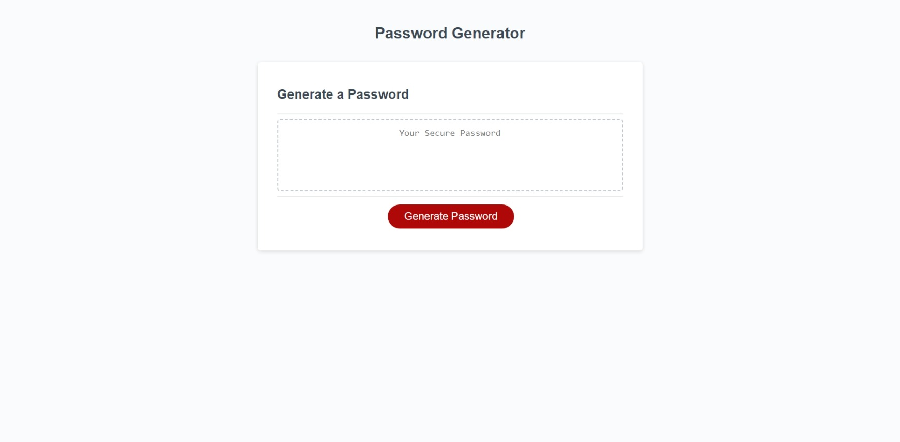

# password-generator
Random password generator.

## Description
The goal of this project was to create a random password generator given a set of criteria that the user can input. The entire interface is displayed through prompts that the user can interact with. There is also validation implemented so that the user cannot input values that are invalid. This was a really fun project to work on that really helped me learn the fundamentals of JavaScript. 

## Installation
There is no installation required for the project. Just visit the webpage and follow the series of prompts to generate your password. 

## Usage
When you open the page and click on the Generate Password button you are shown prompts that allow you to select what criteria you would like include when generating your password such as length, lowercase, uppercase, numbers, and special characters. Once you go through the series of prompts a random password will be generated for you in the box provided in which you can copy and use for any password you like. 

https://adamhood15.github.io/password-generator/ 

## Credits
All HTML and CSS for the webpage was provided by the Rice Coding Full Stack Bootcamp. All JavaScript was written by myself.

## License
Please refer to the license in the repo.